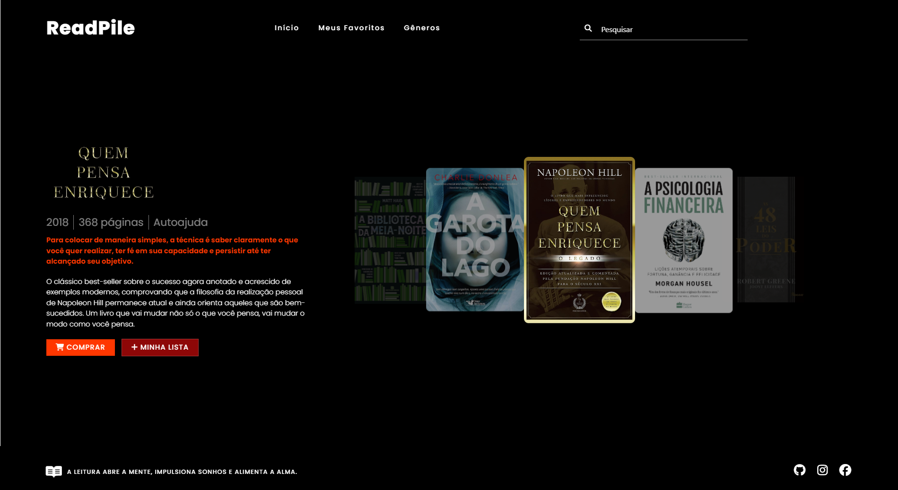
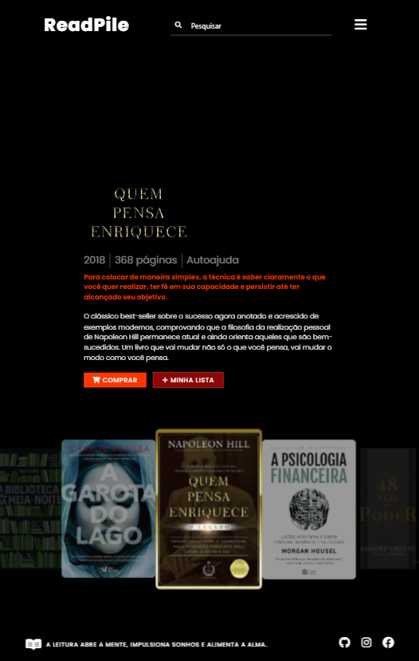

 <h1 align="center">
    
ReadPile 📚

</h1>

## 📖 Sobre
Bem-vindo ao ReadPile, pode ser interpretado como pilha de livros já lidos. Mergulhe em uma seleção diversificada de livros lidos por mim. 👩‍💻

### ✨ Funcionalidades Principais

- **Responsividade:** O layout é adaptável para desktops, tablets e dispositivos móveis, garantindo uma experiência consistente em diferentes telas.
- **Carrossel Infinito:** Implementa um carrossel de capas de livros, utilizando a biblioteca Materialize, proporcionando uma forma interativa de visualizar conteúdo.
-  **Organização do Código:** O código foi estruturado e documentado de forma clara e organizada, facilitando a compreensão e manutenção.

### 📱 Demonstração de Responsividade

#### Desktop

#### Tablet

#### Mobile

### 💻 Como Acessar  
Você pode acessar o ReadPile diretamente [aqui](https://read-pile.vercel.app/). 👀

## 🚀 Tecnologias Utilizadas

- HTML
- CSS
- JavaScript
- jQuery
- Materialize CSS
---
Desenvolvido por [Carolina Lima](https://github.com/CarolinaLM)👩‍💻 - 2024

